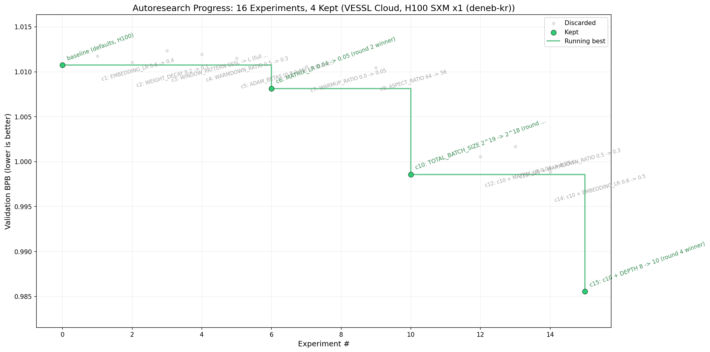

# autoresearch on VESSL Cloud

Run [karpathy/autoresearch](https://github.com/karpathy/autoresearch) — the
"AI agent does its own LLM research while you sleep" experiment — without
owning a GPU, **and with parallelism**. Every training run is a
`vesslctl job create` against a single-GPU spec, so you can run N agents
concurrently on N independent research threads (each on its own
`autoresearch/<tag>` branch) and get N× the experiments per night. With one
local GPU karpathy's loop is strictly sequential; on VESSL it isn't.

You edit code locally, the agent loop submits jobs, you wake up to ~50
experiments per agent (or 100, 200, … if you fan out) and a hopefully
better model.

| GPU | Cost / experiment | Wall time per experiment | Peak VRAM | Baseline val_bpb |
|-----|------------------:|-------------------------:|----------:|-----------------:|
| H100 SXM 80 GB × 1 (deneb-kr, $2.39/hr) | ~$0.33 | ~8m21s (5 min train + ~3:21 startup) | 44.0 GB | 1.010748 |

Numbers measured 2026-05-03 on VESSL Cloud — full breakdown in [benchmarks.md](./benchmarks.md).

## What this recipe is

The autoresearch idea (verbatim from karpathy): give an AI agent a small but
real LLM training setup and let it experiment autonomously overnight. It
modifies the code, trains for 5 minutes, checks if val_bpb improved, keeps
or discards, repeats.

This recipe is a thin VESSL Cloud adaptation:

- **`prepare.py` and `train.py` are unmodified** from the upstream repo. The
  agent edits `train.py` directly, same as the original.
- **`program.md` is rewritten** so the agent submits VESSL jobs instead of
  running `uv run train.py` locally. The loop semantics (per-experiment
  branch, keep-or-revert, NEVER STOP) are preserved.
- **`batch-job/submit.sh` and `batch-job/prep.sh` are new.** They wrap
  `vesslctl` so the agent never needs to know the CLI.

You analyze results locally with `analysis.ipynb` and `results.tsv`, the
same way you would with a local-GPU run.

A side-by-side diagram of the two architectures (original vs VESSL Cloud,
Mode B fan-out included) is in [`architecture.excalidraw`](./architecture.excalidraw)
— open it at [excalidraw.com](https://excalidraw.com) (Menu → Open) for
the visual.

## Prerequisites

- A VESSL Cloud account with credits.
- `vesslctl` installed and authenticated (`vesslctl auth status`).
- A VESSL org and team active on `vesslctl`. The interactive `vesslctl auth
  login` flow prompts you to pick both, and `vesslctl auth status` shows the
  resolved context. To change them later without re-logging-in:
  ```bash
  vesslctl config set default_org  <your-org>
  vesslctl config set default_team <your-team>
  vesslctl auth status   # confirm
  ```
  Or override per-command with `--org` / `--team` flags (or the
  `VESSLCTL_ORG` / `VESSLCTL_TEAM` env vars). All `vesslctl` invocations in
  this recipe — `volume create`, `prep.sh`, `submit.sh` — pick up whichever
  org and team are currently active.
- An object volume to hold the data cache (~10 GB). Create one once:
  ```bash
  vesslctl volume create \
    --name autoresearch-cache \
    --storage <your-object-storage-slug> \
    --teams <your-team>
  vesslctl volume list  # grab the new volume's slug
  export AUTORESEARCH_CACHE_VOLUME=objvol-...
  ```
- A coding agent that can run shell commands locally (Claude Code, Codex,
  Cursor, etc.).

Find your object storage slug with `vesslctl storage list`. Find resource
specs and clusters with `vesslctl resource-spec list` and
`vesslctl cluster list`.

## Two ways to run

This recipe is fundamentally Path B (batch jobs) — there is no notebook
walk-through because the workflow is "agent runs in a loop overnight." The
two ways below differ in *who* drives the loop.

### Path A — Drive the agent yourself (one-off)

Useful for sanity-checking the setup before turning the agent loose
overnight.

```bash
# 1. One-time data prep (downloads ~10 GB into AUTORESEARCH_CACHE_VOLUME).
bash batch-job/prep.sh

# 2. Cut a branch, run the baseline once.
git checkout -b autoresearch/sanity-check
bash batch-job/submit.sh > run.log 2>&1
grep "^val_bpb:\|^peak_vram_mb:" run.log
```

If `val_bpb` shows up, the recipe is wired correctly.

### Path B — Hand it to the agent (overnight loop)

```bash
# In your coding agent (Claude Code, Codex, etc.), with this directory open:
> Have a look at program.md and let's kick off a new experiment.
> Let's do the setup first.
```

The agent reads `program.md`, walks the setup checklist (cuts a branch,
verifies the cache volume), then enters the experiment loop. Every iteration
is a `bash batch-job/submit.sh` call. You wake up to a populated
`results.tsv` and an `autoresearch/<tag>` branch on `vessl-cloud-cookbook`
with one commit per kept experiment.

## Running in parallel

The thing the cloud version can do that the original autoresearch can't:
*K experiments running at once*. There are two ways to use that, and they
compose:

### Option 1 — One agent, batch mode (in-session fan-out)

Within a single agent session, the agent submits K candidate experiments
asynchronously, waits for them all to finish, then picks the winner. This
is "Mode B" in [program.md](./program.md). Best for sweeps and breadth-first
exploration ("try LR ∈ {0.02, 0.04, 0.06, 0.08} apples-to-apples").

The two helper scripts that enable it:

- `batch-job/submit-async.sh` — submit one job and return the slug
  immediately. Doesn't wait.
- `batch-job/wait-jobs.sh slug1 slug2 ...` — poll N slugs until all
  terminal, then print the train.py summary block (`val_bpb`, `peak_vram_mb`,
  …) for each. Use this once K async submissions have happened.

The classic blocking `submit.sh` is still the right tool for "Mode A"
(linear keep-or-revert). The agent picks which mode at run start and
sticks with it for the run.

### Option 2 — Multiple agents, multiple terminals (multi-thread research)

Spawn N independent agent sessions on N different tags; each one runs its
own loop (Mode A or Mode B), they don't talk to each other. Best when the
research directions themselves are different (one agent on optimizer,
another on architecture, another on data).

```bash
# Terminal 1 — agent A (e.g. exploring optimizer hyperparameters)
cd autoresearch && claude   # then: "have a look at program.md, tag: opt-may3"

# Terminal 2 — agent B (e.g. exploring architecture)
cd autoresearch && claude   # then: "have a look at program.md, tag: arch-may3"

# Terminal 3 — agent C (e.g. exploring data mixing)
cd autoresearch && claude   # then: "have a look at program.md, tag: data-may3"
```

Each agent works on `autoresearch/<its-tag>` and submits jobs named
`autoresearch-<its-tag>-<commit>`, so the streams don't collide. With
N agents in Mode A you get ~N × 6.8 ≈ 7N experiments/hour. If each agent
is *also* in Mode B with K=4 candidates per round, you get ~N × K
experiments per ~10-minute round.

### How they compose

The cache volume (read-only after `prep.sh`) is shared by everything; the
job names key off branch + commit so collisions between modes/agents don't
happen. Cap your VESSL concurrency from the cloud console if you don't
want all N×K running at once.

The "research org" framing in the [autoresearch teaser](https://github.com/karpathy/autoresearch)
is much more interesting once you can actually run experiments in
parallel — different research directions, different priors, late-night
synthesis when they all check in.

## Example research cycle

A real 16-experiment, 4-round Mode B cycle on H100 SXM ×1 (deneb-kr) is
bundled as a reference: see [`results.example.tsv`](./results.example.tsv)
and [`progress.png`](./progress.png).



The story it tells (4 KEEPs out of 16):

- **Round 1** (experiments 1–3): single-knob tweaks (`EMBEDDING_LR`,
  `WEIGHT_DECAY`, `WINDOW_PATTERN`). None beat baseline (1.0107).
- **Round 2** (experiments 4–7): **first improvement** — `MATRIX_LR 0.04
  → 0.05` drops val_bpb to 1.0081.
- **Round 3** (experiments 8–11): **`TOTAL_BATCH_SIZE 2^19 → 2^18`
  wins** — smaller batch fits more optimizer steps in the fixed 5-minute
  budget. val_bpb drops to 0.9986.
- **Round 4** (experiments 12–15): on top of the smaller batch, going
  *deeper* (DEPTH 8 → 10) wins — **val_bpb = 0.9856**, beating karpathy's
  published 0.9979 reference.

Total spend: **~$5.10** (16 experiments × ~$0.33 each at $2.39/hr H100).
Wall time: **~40 minutes** (4 rounds × ~10 min each, 4 jobs running in
parallel per round). The same work would take ~2 hours of sequential
compute on a single H100 in the original autoresearch.

To regenerate `progress.png` from your own `results.tsv`, run
`analysis.ipynb` (or `jupyter nbconvert --execute analysis.ipynb`).

## How submit.sh works

```
agent edits train.py → git commit
                     ↓
              bash batch-job/submit.sh
                     ↓
   git push origin autoresearch/<tag>   (force-with-lease)
                     ↓
   vesslctl job create --object-volume CACHE:/root/.cache/autoresearch
                     ↓
   container: clone cookbook @ branch, uv sync, uv run train.py
                     ↓
   vesslctl job logs -f → streamed to stdout → captured to local run.log
                     ↓
   exit 0 if job succeeded, non-zero otherwise
```

The cache volume holds `~/.cache/autoresearch` between jobs, so `prepare.py`
runs only once (in `prep.sh`) and every subsequent job skips it.

## Configuration

`submit.sh` and `prep.sh` read these env vars:

| Var | Required | Default |
|---|---|---|
| `AUTORESEARCH_CACHE_VOLUME` | yes | — |
| `AUTORESEARCH_RESOURCE_SPEC` | no | `resourcespec-5qp3iq5lcd90` (H100 SXM × 1, deneb-kr) |
| `AUTORESEARCH_IMAGE` | no | `pytorch/pytorch:2.4.1-cuda12.4-cudnn9-devel` |
| `AUTORESEARCH_REPO_URL` | no | `https://github.com/vessl-ai/vessl-cloud-cookbook.git` |
| `AUTORESEARCH_TIMEOUT_S` | no | `1800` (submit.sh only) |

To run cheaper on A100 SXM ×1, set `AUTORESEARCH_RESOURCE_SPEC=resourcespec-a100x1`
(betelgeuse-na, $1.55/hr). Note that `train.py` falls back to
`kernels-community/flash-attn3` on non-Hopper GPUs (the upstream code
already handles this), so it runs fine — but val_bpb numbers are not
directly comparable to H100 / karpathy's reference.

## Known limitations

- **Per-experiment overhead is real.** Each VESSL job pays ~3-4 min of
  startup (image pull, `uv sync` / torch reinstall, `train.py` compile) on
  top of the 5-min training budget. Measured throughput is ~6.8
  experiments/hour vs. ~12/hour on a dedicated local GPU. Over an 8-hour
  overnight run, that's ~50 completed experiments.
- **Torch wheel mismatch.** `pyproject.toml` pins `torch==2.9.1` from the
  cu128 wheel index; the default container ships torch 2.4.1 + CUDA 12.4.
  `uv sync` reinstalls torch in-container, and the cu128 wheels bundle their
  own CUDA so this works on any modern driver — but it adds ~30 s to every
  job. If you want to skip it, build a custom image with the project venv
  baked in.
- **Branch hygiene.** The agent runs entirely on a `autoresearch/<tag>`
  branch and force-pushes to origin. Do not run two agents on the same tag
  concurrently — the second one will clobber the first's commits.
- **Cost is unbounded by default.** A runaway loop = real spend. Set a
  daily-cap routine on `vesslctl billing show` if you're nervous.

## Further reading

- Upstream repo and intent: <https://github.com/karpathy/autoresearch>
- Karpathy's announcement tweet: <https://x.com/karpathy/status/2029701092347630069>
- "Dummy's Guide" to autoresearch: <https://x.com/hooeem/status/2030720614752039185>
- VESSL Cloud docs: <https://docs.vessl.ai>
