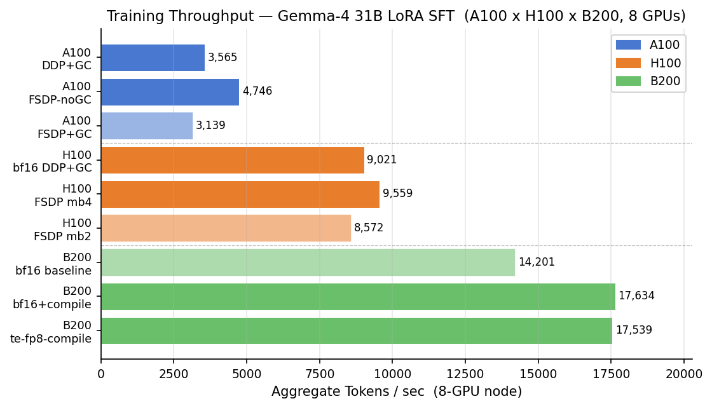
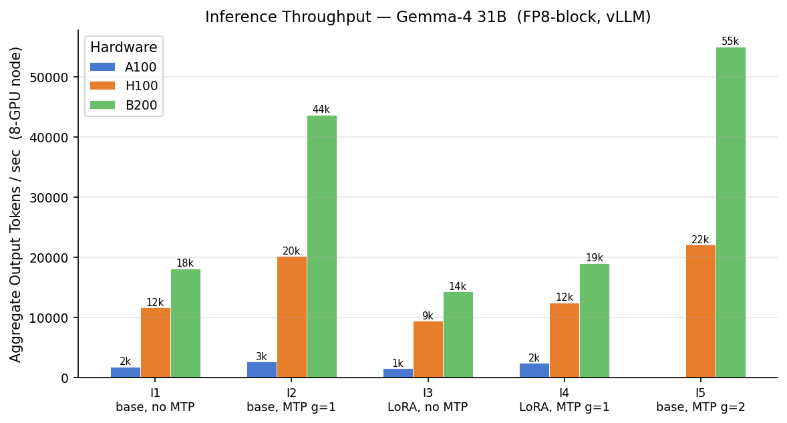
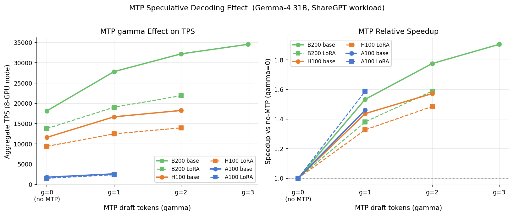
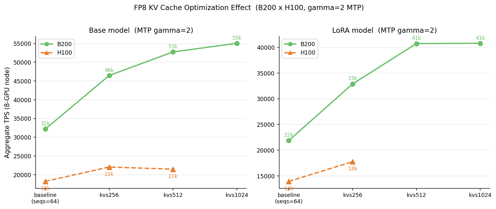
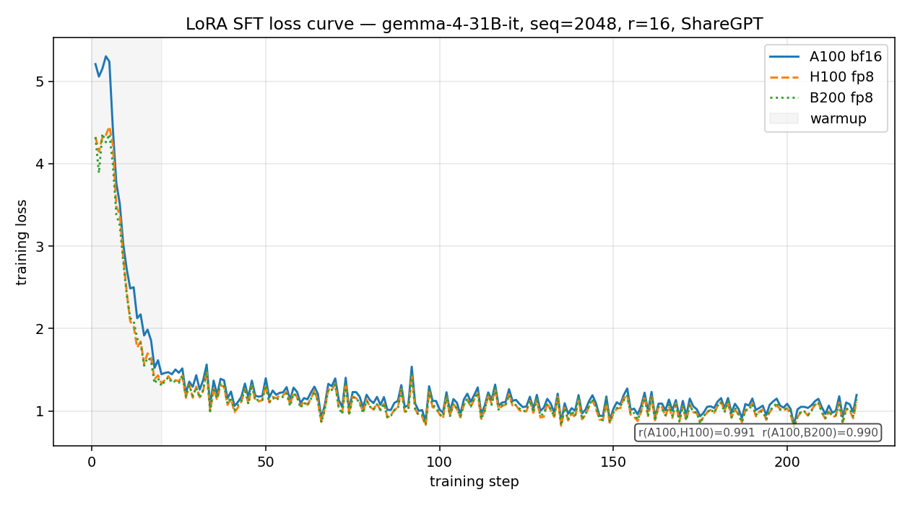

<!--
Stable anchors referenced by external docs / other recipes:
#training-configuration, #inference-serving, #known-limitations.
Rename with care.
-->

# LoRA Training & Inference Cost Benchmark (A100 vs H100 vs B200)

Measure what it actually costs to LoRA fine-tune **and** serve a 31B model on three NVIDIA generations — A100, H100, and B200 — on VESSL Cloud, normalized to cost per token. The recipe ships the sweep scripts (one command per hardware target), the **measured results** from real 8-GPU runs, and the analysis that turns them into the figures below.

| Workload (8-GPU node, best config) | A100 × 8 | H100 × 8 | B200 × 8 |
|---|--:|--:|--:|
| Training throughput (tokens/s) | 4,746 | 9,559 | 17,634 |
| Inference throughput, peak (tokens/s) | 2,591 | 22,062 | 55,066 |
| **Relative cost / token — training** (A100 best = 1.00) | **1.00** | 1.04 | 1.05 |

> Cost is a **relative index only** — no absolute \$/GPU-hour figures. With each platform tuned, cost-per-token lands within ~5%; the differentiators are speed and serving capacity. Numbers measured 2026-05 on VESSL Cloud — full breakdown in [benchmarks.md](./benchmarks.md).

> **Blog walkthrough:** [A100 vs H100 vs B200 for LoRA fine-tuning and inference: a cost benchmark](https://vessl.ai/en/blog/lora-finetuning-cost-a100-h100-b200) tells the story behind these numbers.

## Two ways to run

- **Path A — Interactive notebook** (`notebook/gpu-cost-benchmark.ipynb`): run a **single hardware target** end-to-end (train → serve → benchmark → plot) in one VESSL Cloud workspace. Best for a first run.
- **Path B — vesslctl batch job** (`batch-job/run_full_per_hardware.sh` + `submit.sh`): fire-and-forget the full per-hardware sweep via `vesslctl job create`. Best for reproducing one column of the table.

This recipe is a **benchmark**, not a 15-minute tutorial: a full per-hardware sweep is a multi-cell, 8-GPU job. You don't have to re-run everything — the measured results are bundled under [`results/`](./results), so you can reproduce every figure locally in seconds (see [Reproduce the analysis](#reproduce-the-analysis)).

## Prerequisites

- A **VESSL Cloud** account — [sign up](https://cloud.vessl.ai/~/signup).
- A **Hugging Face access token** — `google/gemma-4-31B-it` is a gated model; request access and export `HF_TOKEN`.
- An **8-GPU resource spec** for your target (e.g. `resourcespec-a100x8`, `resourcespec-h100x8`, `resourcespec-b200x8` — names vary per cluster).
- An **Object storage volume** mounted at `/shared` for the dataset, checkpoints, and results.
- **vesslctl** installed and authenticated (Path B) — see the [vesslctl docs](https://docs.cloud.vessl.ai/).

## Path A: interactive notebook (single hardware target)

1. Create a workspace on VESSL Cloud with an **8-GPU** resource spec, a recent PyTorch + CUDA image (Transformer Engine is needed for the B200 `te-fp8` path), Cluster storage at `/root`, and Object storage at `/shared`.
2. In the JupyterLab terminal:
   ```bash
   cd /root
   git clone https://github.com/vessl-ai/vessl-cloud-cookbook.git
   cd vessl-cloud-cookbook/gpu-cost-benchmark
   pip install -r requirements.txt
   export HF_TOKEN=<your-hf-token>
   ```
3. Open `notebook/gpu-cost-benchmark.ipynb` and **Run All Cells**. It builds the packed dataset, runs one training variant, serves the model with vLLM, benchmarks a concurrency sweep, and plots the result against the bundled reference data.

## Path B: vesslctl batch job

Run the **full sweep for one hardware target** (training cells + inference I1–I4 over a concurrency sweep):

```bash
cd gpu-cost-benchmark/batch-job
chmod +x submit.sh
RESOURCE_SPEC=resourcespec-a100x8 VESSL_OBJECT_VOLUME=<your-volume> ./submit.sh A100 my-first-run
```

`submit.sh` uploads the scripts + dataset to your Object storage volume and calls `vesslctl job create`, which runs `run_full_per_hardware.sh A100` on the node. Tail logs with `vesslctl job logs -f gpu-cost-A100-my-first-run`.

**To benchmark a different GPU, change one argument** — `./submit.sh H100 ...` or `./submit.sh B200 ...` (and set the matching `RESOURCE_SPEC`). The same scripts drive all three.

## Training configuration

LoRA SFT of `google/gemma-4-31B-it`, identical across hardware (`batch-job/train_sft.py`):

| Parameter | Value | Note |
|---|--:|---|
| LoRA `r` / `alpha` | 16 / 32 | adapter capacity (`alpha == 2r`) |
| Target modules | q, k, v, o, gate, up, down | all 7 projections per layer |
| `seq_len` | 2048 | ShareGPT subset, greedy-packed |
| Precision | bf16 (A100) · fp8 / te-fp8 (H100, B200) | A100 has no native FP8 |
| GPUs | 8 | DDP / FSDP / FSDP2+TP variants |

**Key training findings** (see [benchmarks.md](./benchmarks.md)):



- **FSDP without gradient checkpointing beats the DDP default** on A100 and H100 — sharding frees enough memory to drop checkpointing. A100 FSDP-noGC hits 4,746 tok/s, ~33% over the 3,565 DDP baseline.
- **FP8 is a trap unless done right**: naive FP8 on B200 runs at 0.48× bf16 throughput and 2.2× the memory. Only **Transformer Engine FP8 + `torch.compile`** on Blackwell wins (fastest wall-clock overall).
- Cost-per-token is a near-tie across the three best configs; pick on speed.

## Inference serving

vLLM serving (`batch-job/serve_and_bench.sh`), 8 instances at TP=1, swept over LoRA on/off, multi-token prediction (MTP) draft length γ, FP8 KV cache, and concurrency.



- **MTP (speculative decoding)** sweet spot is **draft length 2**: γ=1 adds +53% throughput at 82.8% acceptance, γ=2 another +16%, γ=3 only +7%.



- **LoRA + MTP ship together** — acceptance stays within 0.3 pp of the base model on every platform (the draft is the base model, and a rank-16 adapter barely moves the distribution).
- **FP8 KV cache is the single highest-impact setting**: +44–57% throughput on top of an already-tuned setup, and it pushes the saturation point to higher concurrency.



## Expected results

A successful per-hardware sweep reproduces the columns in the headline table. Highlights:

- **Inference scales with the hardware**: B200 serves >10× the tokens/s of A100, H100 ~6.5× — a much wider gap than training (caveat: A100 runs bf16 vs FP8 on the newer cards, and its 80 GB caps concurrency; read it as a cost-and-capacity result, not pure silicon).
- **Training is stable on all three** (final loss 1.11–1.19); A100 shows the largest warmup grad-norm spike (~1,650 vs ~220 on H100/B200).



Full tables, VRAM, GPU-hours, MTP acceptance, and stability counts are in [benchmarks.md](./benchmarks.md).

## Reproduce the analysis

You don't need GPUs to reproduce the figures — they regenerate from the bundled `results/*.csv`:

```bash
cd gpu-cost-benchmark
pip install pandas matplotlib numpy
python analysis/make_figures.py     # writes images/fig*.png from results/
python analysis/compute_cost.py     # recomputes results/cost_summary.csv (relative index)
```

`results/` holds the aggregated measured metrics (`training.csv`, `inference.csv`, `cost_summary.csv`, `stability_metrics.json`). All cost columns are relative indices (A100 = 100); there are no absolute dollar figures.

## Known limitations

- **A100 vs H100/B200 inference is not apples-to-apples.** A100 runs bf16 (no native FP8) and its 80 GB caps the KV cache, so it saturates at far lower concurrency. The >10× inference gap mixes precision and memory capacity with raw speed — it reflects what you can deploy per card, not clock speed.
- **Acceptance-rate result is LoRA-specific.** A full fine-tune moves the model further from the base draft and could lower MTP acceptance unless the draft is retrained. Only LoRA was measured.
- **Relative cost only.** Absolute \$/GPU-hour is intentionally omitted; use VESSL Cloud pricing to convert GPU-hours to your cost.
- **Reproducibility bounds.** Throughput depends on exact vLLM / Transformer Engine / PyTorch versions and the container image. Pin them for bit-comparable runs.
- **Cost of a full reproduction.** Re-running all three hardware targets end-to-end is a large multi-GPU spend. The bundled `results/` exist so you don't have to.

## Further reading

- VESSL AI blog: [A100 vs H100 vs B200 for LoRA fine-tuning and inference: a cost benchmark](https://vessl.ai/en/blog/lora-finetuning-cost-a100-h100-b200)
- [vLLM speculative decoding](https://docs.vllm.ai/en/latest/features/spec_decode.html)
- [PEFT (LoRA)](https://huggingface.co/docs/peft) · [Transformer Engine](https://docs.nvidia.com/deeplearning/transformer-engine/)
- [VESSL Cloud docs](https://docs.cloud.vessl.ai)
